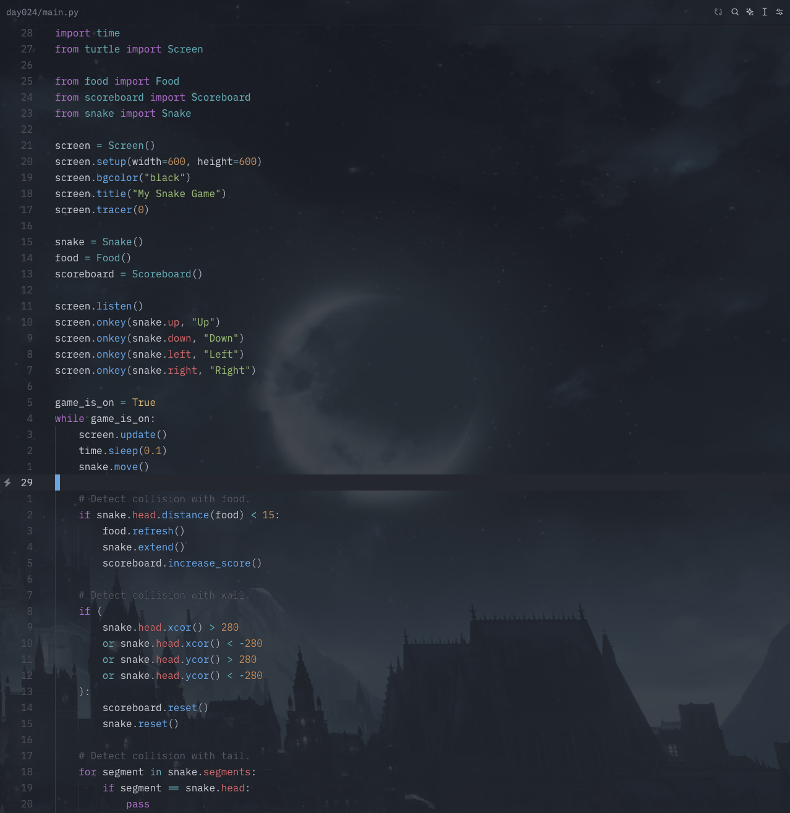
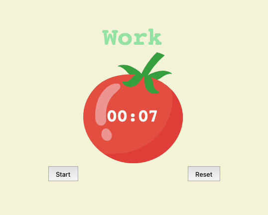

# hundredpies

I am not much of a challenges guy, but this time, I am going to go with a
well know [#100DaysOfCode](https://www.100daysofcode.com) challenge, in my case for Python.

I'm learning Python as a part of my getting to know DevOps stuff journey. First step was to
turn an old macbook into an Ubuntu Server for further learning experiments. Now I am all about
Ansible and Python.

Not going to tweet about my daily coding as the challenge requires, but I do share my DevOps
learning journey on a [freshly baked blog of mine](https://charamza.substack.com). This journey
or a path, let's say, already included completely redoing the way I take notes and the way I learn.

So what I will use to code my way through this challenge? Well, Vim, or NeoVim, of course. Because I want
to learn those as well :P

## Day 7 - Hangman Game

On Day 7, I focused on learning how to fetch data and create a simple CLI game: the classic Hangman.
The game prompts you to enter the length of a word you'd like to guess, fetches the word from
[Random Word API](https://random-word-api.herokuapp.com/home), and then you can start guessing.

I've included the binary [/day007/hangman](day007/hangman), so you can download and run it on macOS or Linux without needing
Python installed. Feel free to give it a try!

## Day 17 - An API Call - Mythology Quiz game

This was fun :) Although the Data class is a bit messed up in my opinion. Creating and object and then calling it's
function to actually populate the object's attribute is probably not the best approach. Well, see you in following days.

## Day 24 - Bye bye games, welcome data

Leaving cli games for a while. Now I'm gonna focus on data manipulation and stuff like that. Say goodbye to the last mini
game I did - a Snake game. Simple, but still enjoyable as in good old Nokia times.

## Day 28 - Pomodoro counter which I might actually use

