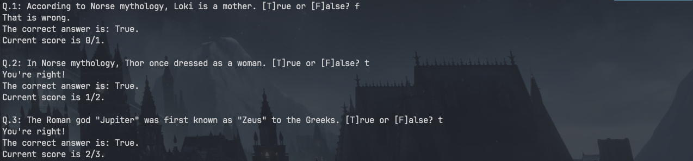

# Requesting API

So this went quite well. I touched the topics like `requests` and `html` escaping 
and also learned a bit about a dictionary unpacking (just a little though). 

But hey! It works and quiz questions are from Mythology so it is actually fun. 

